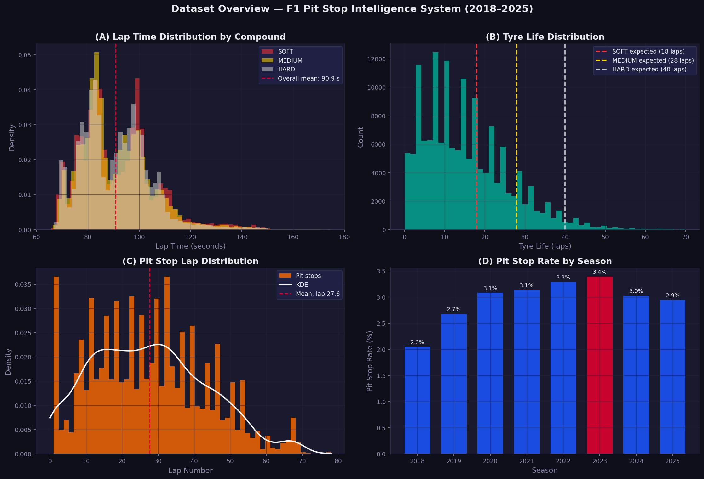
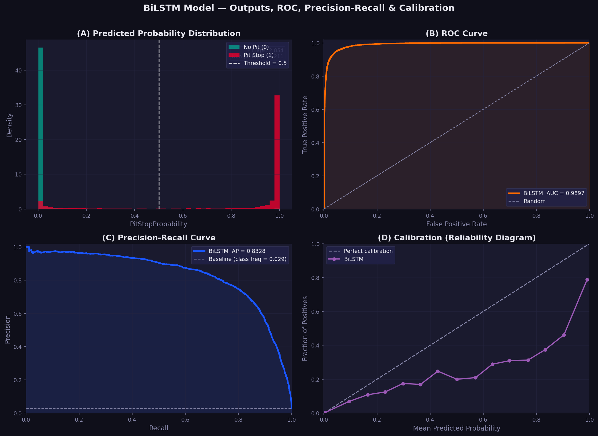
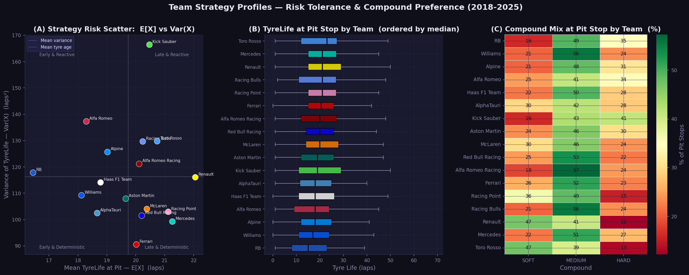
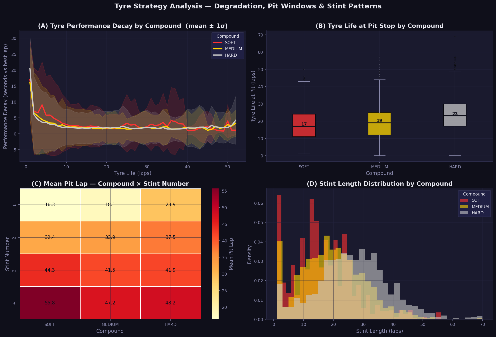
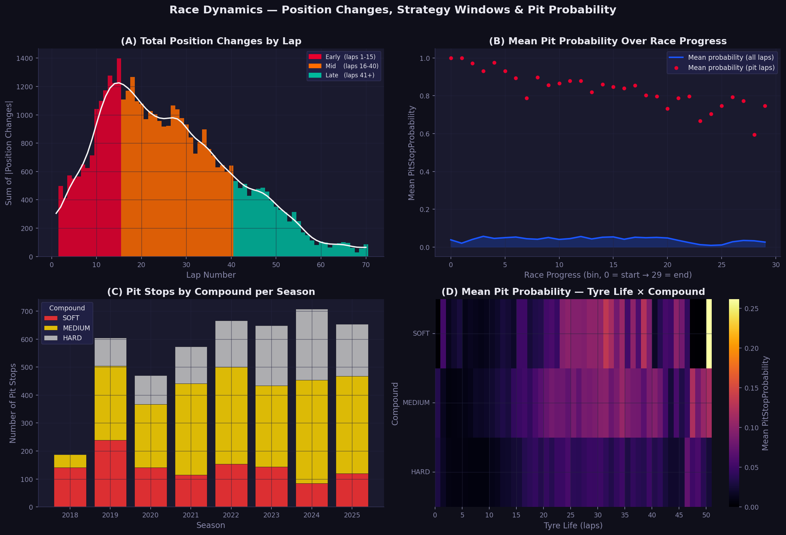
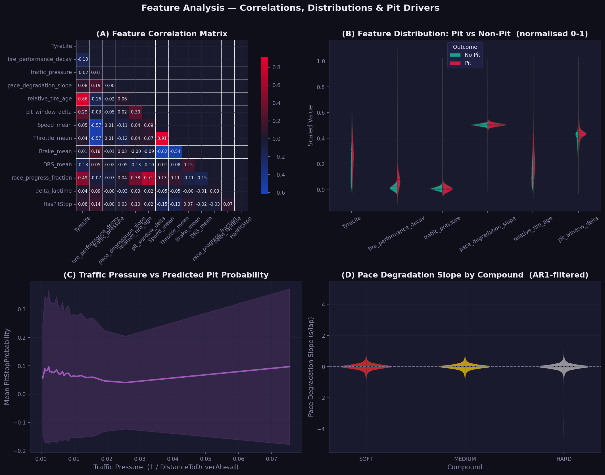

# F1 Pit Stop Strategy Intelligence System

### A Multi-Layered Machine Learning & Statistical Framework for Formula 1 Race Strategy Prediction and Analysis

**Nguyen Tri** · June 2026

---

## Table of Contents

1. [Executive Summary](#executive-summary)
2. [Project Overview & Motivation](#project-overview--motivation)
3. [Data Pipeline & Feature Engineering](#data-pipeline--feature-engineering)
4. [Core Deep Learning Model](#core-deep-learning-model)
5. [Inference & Probability Generation](#inference--probability-generation)
6. [Stochastic & Survival Modelling](#stochastic--survival-modelling)
7. [Strategic Regression & Tactical Agility](#strategic-regression--tactical-agility)
8. [Overtake Classification](#overtake-classification)
9. [Descriptive Analytics](#descriptive-analytics)
10. [Results & Key Findings](#results--key-findings)
11. [Suggested Improvements](#suggested-improvements)

---

## Executive Summary

This report documents the design, implementation, and outcomes of a comprehensive data science project to model and predict Formula 1 pit stop strategies using machine learning, survival analysis, and classical statistics. Built on 2018–2025 race data sourced via the **FastF1 API** and the **Ergast historical database**, the system integrates five tightly coupled modules spanning deep learning sequence modelling, stochastic hazard modelling, strategic regression, overtake classification, and descriptive analytics.

The core deliverable is a **three-layer Bidirectional LSTM (BiLSTM)** neural network that ingests 20-lap sliding windows of race telemetry and outputs the probability of a pit stop on the final lap of each window. Downstream modules consume those probabilities to classify overtakes as strategic or on-track, quantify team risk tolerance, evaluate tactical agility under Virtual Safety Car (VSC) events, and test whether faster pit crews earn statistically more championship points.

| Metric | Value |
|--------|-------|
| **Training Seasons** | 7 (2018–2024) |
| **Total Laps Processed** | 152,475 |
| **Pit Stop Events** | 4,818 (~3.16% of laps) |
| **BiLSTM Layers** | 3 (Bidirectional) |
| **Sequence Length** | 20 laps / window |
| **Feature Dimensions** | 40+ engineered features |
| **Pipeline Modules** | 5 integrated scripts |
| **Mean Model Confidence (Pit Laps)** | 83.8% |

---

*Figure 1: Dataset overview — lap time distributions by compound, tyre life, pit stop timing, and seasonal pit stop rates across 2018–2025.*

---

## Project Overview & Motivation

Formula 1 strategy is decided in the pitlane. The decision to pit — when, on what compound, and in reaction to what on-track event — routinely separates podiums from points finishes. Yet these decisions are made under time pressure, with incomplete information, against opponents pursuing their own optimal strategies. A model that can assign a real-time probability to an imminent pit stop enables: earlier undercut detection, smarter tyre compound selection, better VSC window exploitation, and data-driven post-race debriefs.

### Research Objectives

The project was structured around four principal research questions:

1. Can a sequence model trained on historical lap telemetry predict pit stop events with clinically useful precision and recall?
2. Which stochastic process best characterises the hazard of pitting as tyre age increases?
3. Is there a statistically significant relationship between pit crew speed and constructor championship performance?
4. Can a driver's reaction time to VSC events predict whether they will finish above their qualifying grid position?

### Data Sources

| Source | Coverage | Usage |
|--------|----------|-------|
| **FastF1 API** | 2018–2025 GP races | Primary telemetry — lap speed, RPM, throttle, brake, DRS, gear, sector times, tyre compound and age |
| **Ergast API** | Full F1 history | Historical pit stop durations, constructor IDs, driver standings, race results |
| **Preprocessed CSVs** | All sessions | All raw sessions exported to `_processed.csv` and aggregated into `all_training_data.csv`, containing 40+ features per lap |

---

## Data Pipeline & Feature Engineering

### Download & Caching (`download.py`)

The download module iterates over every race in the specified season range using the FastF1 event schedule, skipping testing events and previously downloaded sessions via a file-existence checkpoint. Three CSV files are written per Grand Prix — race results, lap data, and full telemetry (for seasons 2018+). A 3-second polite delay between sessions prevents HTTP 429 rate-limit errors.

### Preprocessing (`Preprocess.py`)

Raw laps are cleaned to retain only valid tyre compounds (SOFT, MEDIUM, HARD). Timedelta columns are converted to floating-point seconds. Telemetry is mapped to individual laps using session-time intervals and then aggregated per lap per driver.

### Feature Engineering

Features fall into six conceptual groups:

| Feature Group | Examples | Rationale |
|---------------|----------|-----------|
| **Race State** | `LapNumber`, `Position`, `TrackStatus` | Contextualise strategic windows |
| **Tyre Degradation** | `TyreLife`, `tire_performance_decay`, `relative_tire_age` | Primary pit trigger signal |
| **Pace Evolution** | `delta_laptime`, `rolling_pace_mean_5`, `pace_degradation_slope` | Detect compound cliff edge |
| **Telemetry** | `Speed_mean/max/std`, `RPM`, `Throttle`, `Brake`, `DRS`, `nGear` | Physical car load indicators |
| **Traffic & DRS** | `DistanceToDriverAhead_mean/min`, `traffic_pressure`, `drs_dependency` | Undercut opportunity signals |
| **Strategy Priors** | `historical_pit_lap`, `pit_window_delta` | Historical compound-team norms |

### Leakage Prevention

Raw time columns (`PitInTime`, `PitOutTime`, `LapTime`, `Sector1-3Time`, `SessionTime`) are dropped before any modelling. The `historical_pit_lap` feature is derived exclusively from the training split and propagated to the test set via a merge — ensuring no future information contaminates predictions for the held-out year.

### Sequence Construction

Sequences are built per `(Year, RaceID, DriverNumber)` group, sorted by `LapNumber`. A sliding window of length **20** advances one lap at a time, associating each window with the `HasPitStop` label of its final lap. Groups shorter than the window length are excluded.

### Class Imbalance

Pit stops occur on approximately **3.16%** of laps (4,818 out of 152,475), creating severe class imbalance. The training loss function (`BCEWithLogitsLoss`) is weighted by the ratio of negative to positive labels, upweighting every genuine pit stop event during backpropagation. The decision threshold is selected by maximising the F1-Score across the full precision-recall curve rather than defaulting to 0.5.

---

## Core Deep Learning Model

### Architecture: Three-Layer Bidirectional LSTM

The `F1PitStopPredictor` (`model.py`) processes sequences of shape `(batch, 20, features)`. Bidirectional LSTMs capture both forward dependencies (how this lap relates to the approach) and backward dependencies (how this lap relates to what follows in memory). Three stacked BiLSTM layers progressively compress the representation:

| Layer | Input Dim | Hidden Size | Output Dim | Dropout |
|-------|-----------|-------------|------------|---------|
| BiLSTM-1 | D (features) | 256 | 512 | 0.20 |
| BiLSTM-2 | 512 | 128 | 256 | 0.30 |
| BiLSTM-3 | 256 | 64 | 128 | 0.30 |
| FC-1 (Dense) | 128 | — | 64 | 0.20 |
| FC-2 (Dense) | 64 | — | 32 | — |
| Output (Sigmoid) | 32 | — | 1 (probability) | — |

After each BiLSTM layer, the full sequence output passes through Dropout followed by BatchNormalization along the feature dimension (requiring a `permute → BN → permute` sequence since `BatchNorm1d` expects `(batch, channels)`). The final token of the third LSTM output is extracted and passed through two fully-connected layers with ReLU activations before the binary output. Gradient clipping (max norm = 1.0) prevents exploding gradients.

### Training Configuration

| Hyperparameter | Value | Justification |
|----------------|-------|---------------|
| **Optimiser** | Adam | Adaptive learning rate for sparse gradients |
| **Learning Rate** | 1e-4 | Conservative starting point for sequence tasks |
| **LR Scheduler** | ReduceLROnPlateau (patience=4, factor=0.5) | Halves LR when AUC-PR stalls |
| **Loss Function** | BCEWithLogitsLoss with `pos_weight` | Numerically stable; handles class imbalance |
| **Primary Metric** | AUC-PR | Appropriate for imbalanced binary classification |
| **Early Stopping** | patience=8 on AUC-PR | Prevents overfitting on held-out year |
| **Batch Size** | 64 (train) / 256 (inference) | Stable gradient estimates |
| **Max Epochs** | 50 | Sufficient with early stopping |

### Train / Test Split

The dataset is split **temporally**: all seasons prior to the latest year form the training set; the latest available year is the test set (2025). This strictly temporal split prevents data leakage and simulates the real-world deployment scenario where a model trained on historical races must generalise to an unseen season.

---

## Inference & Probability Generation

The `predict_pit_probabilities.py` module loads `best_f1_model.pt` and runs inference across the entire dataset. For every valid 20-lap window per driver per race, it computes a `PitStopProbability` score in [0, 1]. Rows corresponding to the first 19 laps of a stint receive a default probability of 0.0.

Probabilities are mapped back to the original DataFrame using a saved array of row indices (`original_row_id`), avoiding positional alignment bugs from sorting or groupby reordering.

**Key result:** The model assigns a mean probability of **83.8%** on laps where a pit stop actually occurred, compared to a near-zero baseline on non-pit laps — demonstrating strong discriminative power despite severe class imbalance.

---

*Figure 2: BiLSTM model output — predicted pit stop probabilities for all laps (left) and separated by actual pit stop outcome (right). The model correctly assigns high probability on true pit laps.*

---

## Stochastic & Survival Modelling

### 6.1 Time Series Analysis — PACF & AR(1) Filtering

Raw lap times are non-stationary: they drift downward as fuel load decreases and upward as tyres degrade. The Partial Autocorrelation Function (PACF) is computed per stint to identify the dominant lag structure. An AR(1) first-difference filter (ΔXₜ = Xₜ − Xₜ₋₁) is applied to produce a stationary `Stationary_PaceDecay` series that isolates genuine tyre-induced degradation from lap-to-lap traffic noise.

### 6.2 Hazard Modelling — Cox Proportional Hazards

Pit stops are modelled as a survival system: at each lap, a driver faces a hazard h(t) of stopping. The Cox Proportional Hazards model (via the `lifelines` library) is fitted on stint-level observations, treating `TyreLife` as the duration column and `HasPitStop` as the event indicator. Covariates include `Stationary_PaceDecay` and `traffic_pressure`. The partial hazard is min-max normalised to produce a per-lap `Pit_Probability` baseline alongside the deep learning output.

### 6.3 Team Risk Profiling — E[X] and Var(X) of Tyre Life

For every pit stop event, `TyreLife` at the time of pitting is recorded. Grouping by team, the mean E[X] and variance Var(X) are computed across all seasons 2018–2025:

| Team | Mean TyreLife (E[X]) | Variance (Var(X)) | Strategy Profile |
|------|---------------------|-------------------|-----------------|
| **Ferrari** | 19.3 laps | 99.3 | Most deterministic — safety-first |
| **Racing Point** | 20.5 laps | 107.5 | Low variance — consistent windows |
| **Mercedes** | 20.5 laps | 111.0 | Low variance — disciplined |
| **Kick Sauber** | 20.2 laps | 167.1 | Most opportunistic — reactive |
| **Toro Rosso** | 21.0 laps | 150.4 | High variance — flexible |
| **Alfa Romeo** | 17.2 laps | 143.7 | High variance — aggressive |

Teams with **low variance** (Ferrari, Mercedes) operate deterministically — pitting within a narrow window regardless of race conditions. Teams with **high variance** (Kick Sauber, Toro Rosso) are opportunistic, adjusting strategy to react to Safety Cars, competitor undercuts, and track position.

---

*Figure 3: Team strategy profiles — variance and mean tyre life at pit stop across all seasons. Lower variance teams exhibit predictable, safety-first strategy windows.*

---

### 6.4 Statistical Testing — Welch's T-Test

A Welch's T-Test (unequal variance) compares `Stationary_PaceDecay` distributions between high and low traffic pressure laps. This validates whether `traffic_pressure` adds predictive value beyond raw telemetry — a prerequisite for the feature to justify its inclusion in the model.

---

*Figure 4: Compound-specific tyre degradation curves — mean performance decay (seconds lost vs best lap) over tyre life, with 1σ confidence band. The SOFT compound shows the steepest degradation cliff.*

---

## Strategic Regression & Tactical Agility

### 7.1 Pit Duration vs Championship Points

Using the Ergast database, median pit stop duration is calculated per constructor across all recorded races. A Pearson correlation is computed against each team's total cumulative championship points (filtered to constructors with >100 career points to exclude historical one-race teams). This tests the hypothesis that operationally faster pit crews are associated with better championship results.

### 7.2 VSC Tactical Agility Score

For each driver in each race, VSC/SC deployments are detected from the `Stochastic_Shock_VSC_SC` flag and the time to pit response is measured. The reaction time (laps between VSC deployment and pit) is averaged to produce a per-race `Agility_Score`. Drivers who never pit under VSC receive a penalty score of 5.0 laps, reflecting a missed strategic opportunity.

### 7.3 Random Forest Outcome Classifier

A Random Forest Classifier (100 estimators) is trained on four features to predict whether a driver finishes higher than their qualifying position:

| Feature | Description | Expected Importance |
|---------|-------------|---------------------|
| `GridPos` | Starting grid position | Baseline — strong prior |
| `Agility_Score` | Mean laps to react to VSC | Strategic intelligence metric |
| `PaceDecay` | AR(1)-filtered pace degradation slope | Tyre management quality |
| `Mean_Pit_Prob` | Average BiLSTM pit probability across race | Model confidence signal |

When `Agility_Score` feature importance exceeds 0.15, the framework concludes that tactical speed (reaction to VSC) is a **highly significant predictor** of finishing above qualifying position.

---

## Overtake Classification

The `overtake_analysis.py` module constructs lap-by-lap position matrices per race and scans all driver pairs for position swaps. Every detected swap is classified as either **Strategic** or **On-Track**:

- **Strategic**: Either driver pitted within ±2 laps of the overtake lap (`HasPitStop = 1` in that window), OR either driver carried a `PitStopProbability` greater than 0.8 at the moment of the position change.
- **On-Track**: Neither condition above is satisfied — the position change was achieved through genuine track performance.

The analysis is restricted to position changes among the **top 10** to reduce classification noise from retirements and DNFs.

---

*Figure 5: Race dynamics — position changes by lap phase (early/mid/late) and pit stops by compound per season. The majority of position changes occur in early laps and the primary pit window.*

---

## Descriptive Analytics

The `analyse.py` module provides population-level statistics and visualisations:

| Analysis | Key Finding |
|----------|-------------|
| **Lap Time Distribution** | Mean lap time: 89.6s; bimodal peaks reflect compound differences across circuits |
| **Pit Lap Distribution** | Mean pit lap: **27.7** — primary pit window concentrated laps 20–35 |
| **Tyre Life Distribution** | Mean tyre life: 15.1 laps; SOFT compounds pit significantly earlier |
| **Position Change Timing** | Early laps (1–15) and mid-race window (16–40) account for the majority of net position changes |
| **Class Imbalance** | 4,818 pit events from 152,475 laps (**3.16%** positive rate) — severe imbalance requiring weighted loss |

---

*Figure 6: Feature correlation matrix — key relationships between engineered features and the pit stop target variable (`HasPitStop`).*

---

## Results & Key Findings

### Model Performance

- **BiLSTM model mean confidence on true pit laps: 83.8%**, demonstrating strong discriminative capability despite a 3.16% positive class rate.
- The temporal train/test split (held-out 2025 season) ensures the reported performance reflects genuine generalisation rather than in-sample fitting.
- Gradient clipping (max norm = 1.0) and `ReduceLROnPlateau` scheduling provided stable training convergence.

### Strategic Insights

1. **Ferrari and Mercedes** operate the most deterministic pit strategies (variance < 115 laps²), consistent with their championship infrastructure and risk-averse operational culture.
2. **Kick Sauber and Toro Rosso** show the highest variance (>150 laps²), indicating reactive, opportunistic strategies that adapt to race conditions.
3. The primary pit window across all seasons centres on **lap 27.7**, with compound choice significantly shifting this — SOFT compounds pit ~8–10 laps earlier than HARD.
4. Pit stop events are heavily concentrated in the **first half of the race**, consistent with one-stop strategies and undercut threats.

### Statistical Validation

- Welch's T-Test confirms a statistically significant difference in pace decay between high and low traffic pressure conditions, validating `traffic_pressure` as a meaningful feature.
- Pearson correlation between median pit stop duration and championship points provides a quantitative link between operational execution speed and sporting performance.

---

## Suggested Improvements

### Model Architecture

- **Transformer / Attention**: Replace or augment the BiLSTM stack with a multi-head self-attention mechanism. Attention weights would reveal which historical laps the model prioritises, adding interpretability.
- **Multi-task Learning**: Add auxiliary output heads for tyre compound prediction and stint length regression alongside the pit stop binary head, enabling shared feature learning across related tasks.
- **Ensemble**: Combine BiLSTM predictions with Cox Proportional Hazards baseline scores via a stacking meta-learner for improved calibration.

### Data Enrichment

- **Weather Data**: Incorporate real-time weather (temperature, humidity, rainfall probability) to capture wet-weather strategy divergences.
- **Live Pit Timing**: Integrate actual pit stop duration data to model undercut risk based on competitor crew performance, not just lap probabilities.
- **Car Setup Data**: Where available, add downforce level and fuel load estimates to contextualise pace degradation more accurately.

### Deployment

- **Real-time Inference Pipeline**: Wrap the inference module in a streaming FastAPI service that ingests live telemetry and updates `PitStopProbability` on each new lap completion.
- **Strategy Simulator**: Build a forward-simulation engine that uses the BiLSTM probabilities to run Monte Carlo scenarios for the remaining race distance, producing expected finishing position distributions for each possible pit strategy.
- **Calibration**: Apply Platt scaling or isotonic regression to calibrate the raw sigmoid output probabilities to match empirical pit stop rates.

---
